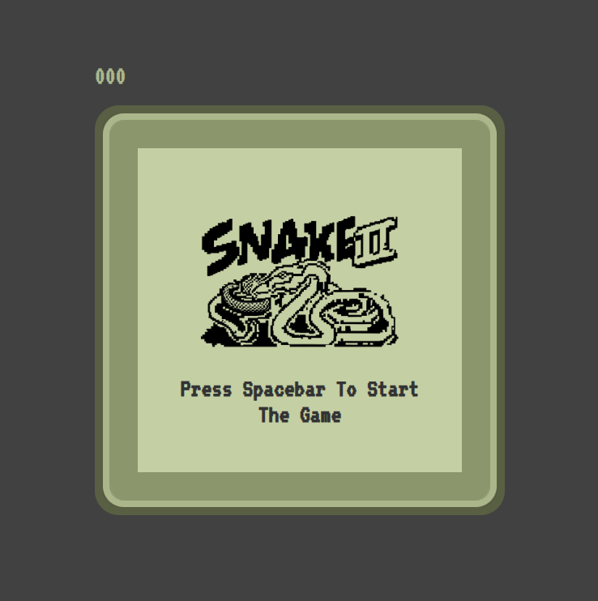

# Snake Game

## Description
This is a classic Snake game implemented using HTML, CSS, and JavaScript. It provides a nostalgic gaming experience where players control a snake on a grid, eat food to grow longer, and avoid collisions with walls and the snake's own body.

## How to Play
- Use the arrow keys on your keyboard to change the snake's direction (up, down, left, right).
- Press the spacebar to start or restart the game.
- Guide the snake to eat food (displayed as gray cubes) to score points and grow longer.
- Avoid collisions with the walls or the snake's own body.
- The game ends when the snake collides with the wall or itself.

## Features
- Score tracking, including a high score that persists across sessions.
- Smooth and intuitive gameplay mechanics.
- Adjustable game speed as the snake grows longer.

## Preview

